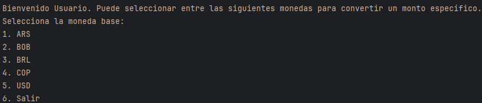

# Conversor Monedas
Este proyecto es el resultado de la resolución del Challenge Practicando con Java: Challenge Conversor de Monedas de Alura Latam | ONE, es una aplicación de consola en Java que permite convertir cantidades entre diferentes monedas utilizando una API de tasa de cambio. La aplicación soporta conversiones entre ARS, BOB, BRL, COP y USD.

## Funcionalidades

- Selección de moneda base y moneda destino.
- Conversión de un monto ingresado por el usuario.
- Integración con una API externa para obtener las tasas de cambio actuales.
- Opción para salir de la aplicación.

## Requisitos

- Java 8 o superior.
- Biblioteca Gson para la manipulación de JSON.

## Uso
Ejecuta la clase principal ConversorDeMonedas para iniciar la aplicación.

## Ejemplo de uso

La aplicación da un mensaje de bienvenida y despliega un menu

Luego se puede escoger entre las monedas y realizar la conversión del monto deseado

## Autor
Desarrollado por Tu Juan D'Aleman.

## Licencia
Este proyecto está licenciado bajo la Licencia MIT.
